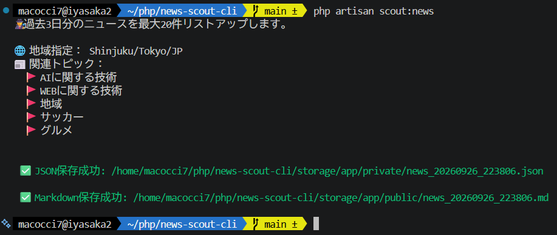
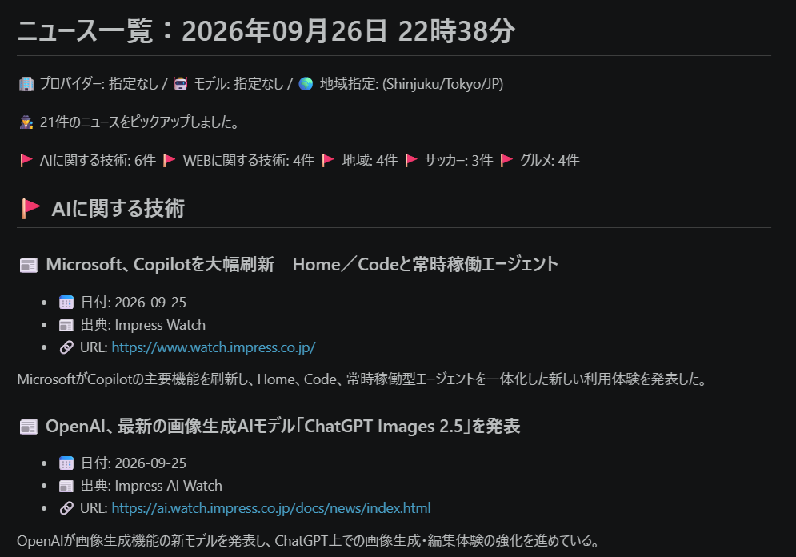

# News Scout CLI (Powered by Laravel AI SDK)

指定トピックの最新ニュースを収集するCLIツールです。



## 前提

- 対応言語：日本語
- [Git](https://git-scm.com/book/ja/v2/%E4%BD%BF%E3%81%84%E5%A7%8B%E3%82%81%E3%82%8B-Git%E3%81%AE%E3%82%A4%E3%83%B3%E3%82%B9%E3%83%88%E3%83%BC%E3%83%AB)インストール済（なくても使えます。あればコピーと更新が楽。）
- PHP8.3CLI以降インストール済（Laravel13要件）
- [Composer v2](https://getcomposer.org/) インストール済
- [Laravel AI SDK WebSearch provider tool](https://laravel.com/framework/docs/13.x/ai-sdk#web-search)サポート対象のAIサービスが利用可能

## 使い方

このリポジトリを何らかの手段でローカルにコピーしてください。

▼Gitが使える場合
```bash
git clone https://github.com/macocci7/news-scout-cli.git
```

▼Gitが使えない場合
- [https://github.com/macocci7/news-scout-cli](https://github.com/macocci7/news-scout-cli)を開く
- 画面上部緑色の「Code」ボタンから「Download ZIP」を選択
- ダウンロードしたZIPを展開

ローカルにコピーしたリポジトリのフォルダに入ります。
```bash
cd news-scout-cli
```
次のコマンドで依存関係をインストールしてください。
```bash
composer install
php artisan vendor:publish --provider="Laravel\Ai\AiServiceProvider"
```
`.env`に[APIキー](https://laravel.com/framework/docs/13.x/ai-sdk#configuration)を設定してください。
```
OPENAI_API_KEY=sk-proj-********************************
```

CLI上でコマンドで実行します。

▼コマンドの書式
```bash
Usage:
  scout:news [options] [--] [<provider> [<model>]]

Arguments:
  provider                     AIプロバイダー 例: openai, gemini
  model                        AIモデル名

Options:
      --topic[=TOPIC]          トピック指定 (multiple values allowed)
      --add-topic[=ADD-TOPIC]  デフォルトと併せて追加指定するトピック (multiple values allowed)
      --days[=DAYS]            過去何日分のニュースを取得するか
      --max[=MAX]              最大取得件数
      --location[=LOCATION]    地域指定。city/region/country 例: Shinjuku/Tokyo/JP
```

▼コマンド例
```bash
php artisan scout:news
php artisan scout:news openai
php artisan scout:news openai gpt-5.6-luna
php artisan scout:news --topic=ゲーム --topic=アニメ
php artisan scout:news --add-topic=ゲーム --add-topic=アニメ
php artisan scout:news --days=1 --max=5 --location=Shinjuku/Tokyo/JP
```
プロバイダー名を省略した場合、`config/ai.php`内の`default`の値(openai)が選択されます。

モデル名を省略した場合、一番安いモデルが選択されます。

該当するプロバイダー・モデルが無い場合、エラーになります。

AIからのレスポンスは`storage/app/private/`にJSON形式で保存されます。

AIからのレスポンスを基に生成したニュース一覧は`storage/app/public/`にMarkdown形式で保存されます。



## アップデートの仕方

▼依存関係のアップデート
```bash
composer update
```
▼このリポジトリの更新をローカルに反映する
```bash
git fetch origin
git pull origin main
```
▼上記２つをまとめて実行
```bash
composer update-repo
```

## LICENSE

[MIT](LICENSE)
